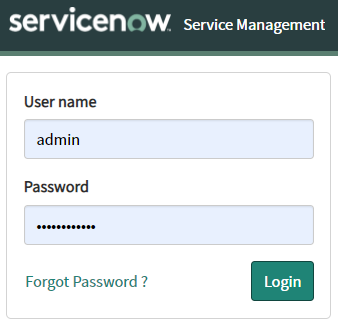
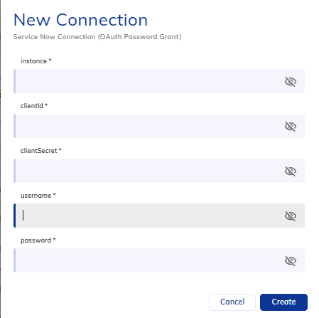
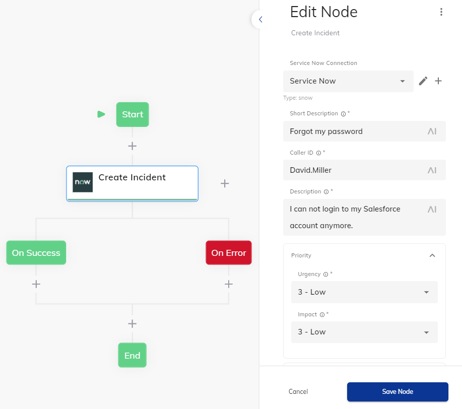
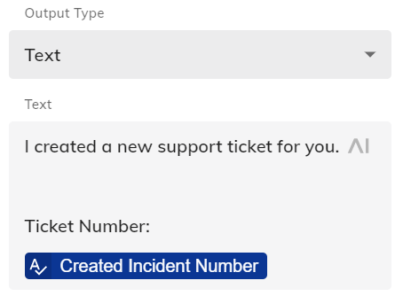
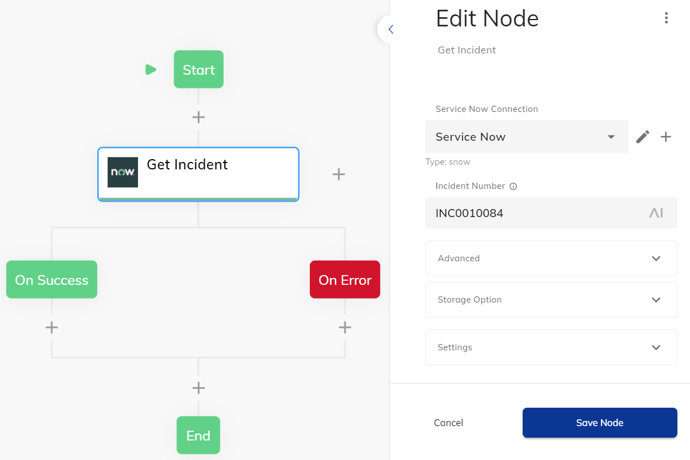
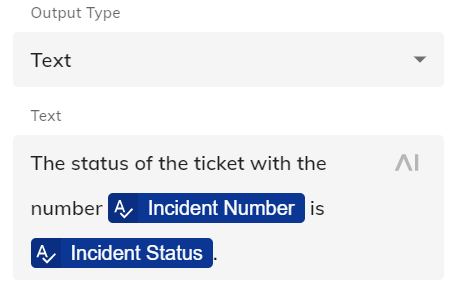
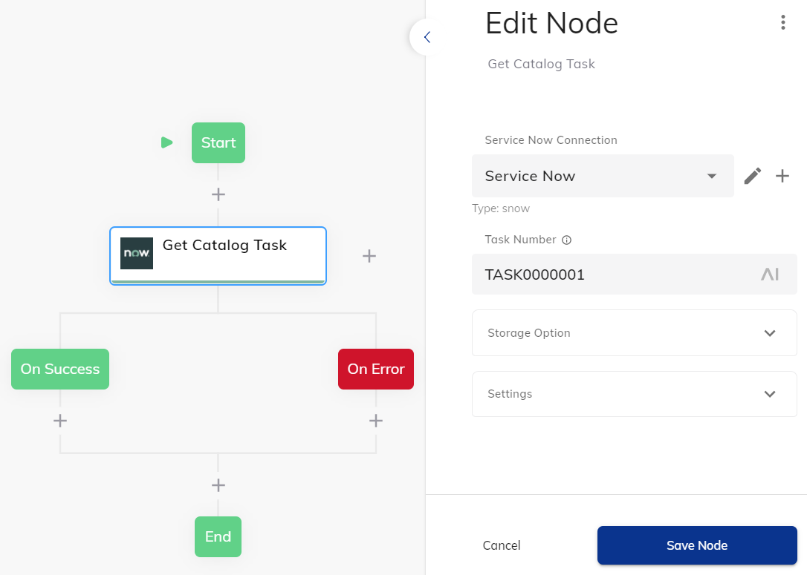
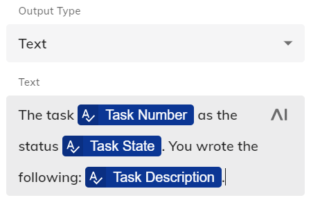
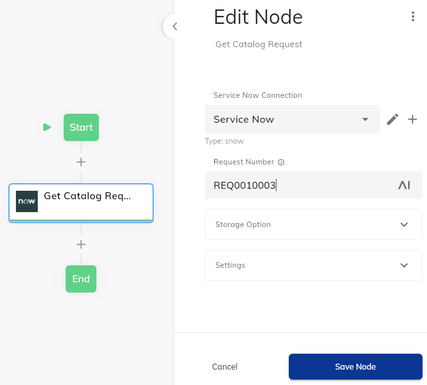
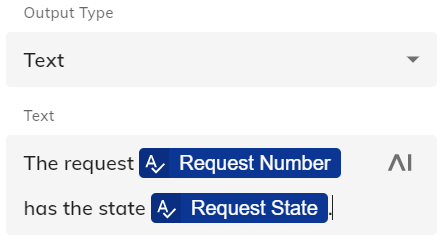

# Service Now Extension

Integrates the Service Now Software with Cognigy.AI.

> **Upgrading from 4.x?** As of 5.0.0 this extension uses **OAuth 2.0 (Password Grant)** instead of HTTP Basic Auth. Existing `snow` connections from 4.x will no longer authenticate — open each connection and fill in the new `clientId` / `clientSecret` fields (see below).

## Connection

Before the Extension can be used to work with *Incidents*, the *Service Catalog*, *Knowledge*, or *Email*, a Connection of type **Service Now Connection (OAuth Password Grant)** needs to be created in Cognigy.AI. Every node call exchanges these credentials for a short-lived OAuth token at `POST {instance}/oauth_token.do` and uses it as a bearer token on the request.

The connection has five fields:

  - **instance**
    - URL of the Service Now installation, e.g. `https://dev12345.service-now.com` or `https://mycompany.service-now.com`. A bare hostname (`mycompany.service-now.com`) is also accepted — `https://` is added automatically.
  - **clientId**
    - The Client ID of the OAuth application registered in ServiceNow (see "Creating the OAuth client" below).
  - **clientSecret**
    - The Client Secret issued for the same OAuth application.
  - **username**
    - The Service Now user account that the agent will act as. This user's roles determine what the extension can read and write (e.g. `incident_manager`, `catalog`, `knowledge`).
  - **password**
    - The password for the user above.

### Creating the OAuth client in ServiceNow

1. In ServiceNow, navigate to **System OAuth → Application Registry**.
2. Click **New** → **Create an OAuth API endpoint for external clients**.
3. Give it a name (e.g. `Cognigy.AI`). ServiceNow will generate a **Client ID** and **Client Secret** — copy both into the Cognigy connection.
4. Leave the default **Refresh Token Lifespan** and **Access Token Lifespan**, or adjust to your security policy. The extension fetches a fresh token on every node execution, so a short access-token lifespan is fine.
5. Save the record.

The user supplied as `username` must have the roles required by the API endpoints the extension calls (Table API, Service Catalog API, Knowledge API, Email API).



In Cognigy, the connection editor for this Extension exposes the five OAuth fields described above:



## Incidents

With the help of this Extension, the Cognigy.AI virtual agent is able to **create** and **retrieve** incidents from Service Now.

### Node: Create Incident

One common use-case for Service Now is to crete a new incident in the [Incidents Table](https://www.servicenow.com/products/incident-management.html):



From default, the result will be stored in the [Input Object](https://docs.cognigy.com/docs/input). It consists of the detailed information about the successfully created incident:

```json
{
  "snow": {
    "createdIncident": {
      "sys_updated_on": "2021-04-16 09:22:30",
      "number": "INC0010086",
      "state": "1",
      "impact": "3",
      "priority": "5",
      "short_description": "Forgot my password",

      "description": "I can not login to my Salesforce account anymore. ",
      "category": "inquiry"
    },
    "...": "..."
  }
}
```

This information can be used dynamically in the further Flow, such as in a confirmation Say Node:



### Node: Get Incident

If the virtual agent should provide the same detailed information about an older incident, the **Get Incident** Node could be used. It takes the **Incident Number** and stores the result in Cognigy.AI:



In this case, the result looks similar to the one mentioned above:

```json
{
  "snow": {
    "createdIncident": {
      "sys_updated_on": "2020-12-24 11:00:20",
      "number": "INC0010084",
      "state": "1",
      "impact": "1",
      "priority": "5",
      "short_description": "Computer Monitor is broken",

      "description": "I am not able to use the monitor of my computer anymore. It keeps showing screen",
      "category": "hardware"
    },
    "...": "..."
  }
}
```

This information can be used dynamically in the further Flow, such as in a confirmation Say Node:



### Node: Find Ticket in Text

This is a **utility node** that does **no API call**. It scans the user's most recent input (`input.text`) for a ticket-number pattern and returns the first match. Useful when the user has typed something like *"can you check on INC0010086 for me?"* and you need to extract the ticket number before calling **Get Incident**.

Configuration:

  - **Ticket Type** — one of:
    - *Incident (INC)* — matches `/INC\d+/`
    - *Catalog Request (REQ)* — matches `/REQ\d+/`
    - *Catalog Task (SCTASK)* — matches `/SCTASK\d+/`
  - **Where to store the result** — `Input` (default key `snow.ticket`) or `Context` (default key `snow.ticket`).

If no match is found, nothing is written. The stored value is the matched string (e.g. `"INC0010086"`), not an array. Common pattern: chain this node into a Get Incident / Get Catalog Request / Get Catalog Task node, passing `{{input.snow.ticket}}` as the ticket-number input.

## Service Catalog

"With the ServiceNow® Service Catalog application, create service catalogs that provide your customers with self-service opportunities. Customize portals where your customers can request catalog items such as service and product offerings. You can also standardize request fulfillment to ensure the accuracy and availability of the items in the catalogs. ([Service Now](https://docs.servicenow.com/bundle/newyork-it-service-management/page/product/service-catalog-management/concept/c_ServiceCatalogManagement.html), 2021)". In order to provide this feature in Cognigy.AI as well, the following Flow Nodes can be used.

### Node: Get Catalog Task

If the user wants to get an update about a previously created **Task**, the **Get Catalog Task** Node can be used:



This information can be used dynamically in the further Flow, such as in a confirmation Say Node:




### Node: Get Catalog Request

Next to the Task, one could ask for **Request**, which can be retrieved from Service Now by using the **Get Catalog Request** Node.



This information can be used dynamically in the further Flow, such as in a confirmation Say Node:



### Node: Get Service Catalogs

Returns every catalog the connected user can see (`GET /api/sn_sc/servicecatalog/catalogs`). Use this when you don't know the catalog `sys_id` ahead of time and need to discover what's available.

Configuration:

  - **Where to store the result** — `Input` (default `snow.catalogs`) or `Context` (default `snow.catalogs`).

Each entry in the resulting array contains the catalog's `sys_id`, `title`, `description`, and a `categories` summary. Feed `sys_id` into **Get Service Catalog Details** or **Get Service Catalog Items**.

### Node: Get Service Catalog Details

Returns one catalog and its category tree (`GET /api/sn_sc/servicecatalog/catalogs/{catalogId}`).

Configuration:

  - **Catalog Id** — the `sys_id` of the catalog (e.g. `e0d08b13c3330100c8b837659bba8fb4`). Required.
  - **Where to store the result** — `Input` (default `snow.catalog`) or `Context` (default `snow.catalog`).

The response includes the full `categories` hierarchy with `sys_id`, `title`, and item counts — useful for rendering a category-pick UI to the end user.

### Node: Get Service Catalog Items

Searches catalog items (`GET /api/sn_sc/servicecatalog/items`). Use this to look up an item's `sys_id` from a free-text query before adding it to the cart or ordering it.

Configuration (all in the **Advanced** section, all optional):

  - **Service Catalog ID** (`sysparm_catalog`) — restrict the search to a single catalog.
  - **Limit** (`sysparm_limit`) — maximum records to return. Default: `100`.
  - **Search Text** (`sysparm_text`) — free-text query against item names/descriptions.

Storage defaults to `snow.catalog.items` in input or context. Each result entry has the item's `sys_id`, `name`, `short_description`, `price`, and `category`.

### Node: Add to Cart

Adds a catalog item to the connected user's cart (`POST /api/sn_sc/servicecatalog/items/{sysId}/add_to_cart`). Mirrors the "Add to Cart" button in the ServiceNow self-service portal — items stay in the cart until ordered or removed.

Configuration:

  - **Item Id** (`sysId`) — required. The `sys_id` of the catalog item.
  - **Quantity** (`sysParamQuantity`) — required. Default `1`.
  - **Where to store the result** — `Input` (default `snow.catalog.cart`) or `Context` (default `snow.catalog.cart`).

The result contains the cart's `cart_id`, the updated `items` array, and `subtotal_price` / `total_price`.

This node has **On Success** and **On Error** child branches; route follow-up logic accordingly (e.g. confirmation message on success, retry / handoff on error).

### Node: Order Item Now

Skips the cart and orders a single item directly (`POST /api/sn_sc/servicecatalog/items/{sysId}/order_now`). The result is a Service Catalog Request — the same kind retrieved by **Get Catalog Request**.

Configuration:

  - **Item Id** (`sysId`) — required.
  - **Quantity** (`sysParamQuantity`) — required. Default `1`.
  - **Where to store the result** — `Input` (default `snow.catalog.order`) or `Context` (default `snow.catalog.order`).

The result contains `request_number` (e.g. `REQ0010003`), the underlying `table` (typically `sc_request`), and the `sys_id` of the new request. Pass `request_number` into **Get Catalog Request** to follow up on its state.

This node has **On Success** and **On Error** child branches.


## Knowledge

ServiceNow's [Knowledge Management](https://docs.servicenow.com/bundle/rome-customer-service-management/page/product/knowledge-management/concept/c_KnowledgeManagement.html) module surfaces published articles from one or more knowledge bases. The extension exposes a single search node that hits the public Knowledge API (`/api/sn_km_api/knowledge/articles`).

### Node: Search Articles (Knowledge)

Configuration:

  - **Query** — free-text search string.
  - **Limit** (Advanced) — maximum records to return. Default `30`.
  - **Offset** (Advanced) — starting record index for pagination. Default `0`.
  - **Filter** (Advanced) — encoded query string applied on top of the text search (e.g. `workflow_state=published`).
  - **Fields** (Advanced) — comma-separated list of additional Knowledge-table fields to include in each result.
  - **Kb** (Advanced) — comma-separated list of knowledge-base `sys_id`s to restrict the search to.
  - **Language** (Advanced) — comma-separated list of two-letter language codes (e.g. `en,de`).
  - **Where to store the result** — `Input` (default key `snow`) or `Context` (default key `snow`). Note: the default key here is the **root** `snow` namespace, not `snow.articles` — adjust if you're combining this node with others that also write under `snow`.

Each article entry contains `id` / `sys_id`, `title`, `snippet`, and `link`, plus any extra fields requested via the **Fields** parameter.


## Email

With the Email serivce, one can maintain email messages within Service Now.

### Node: Send Email

- [Documentation](https://docs.servicenow.com/bundle/rome-application-development/page/integrate/inbound-rest/concept/email-api.html)

This Flow Node can be used in order to send an email message with the Service Now SMTP/Pop configuration. It will return the following JSON if the message was sent successfully:

```json
{
  "snow": {
    "email": {
      "id": "...",
      "links": [
        {
          "rel": "self",
          "href": "/now/v1/email/..."
        },
        {
          "rel": "status",
          "href": "/now/v1/email/...?sysparm_fields=id,type,state,error"
        }
      ]
    }
  }
}
```